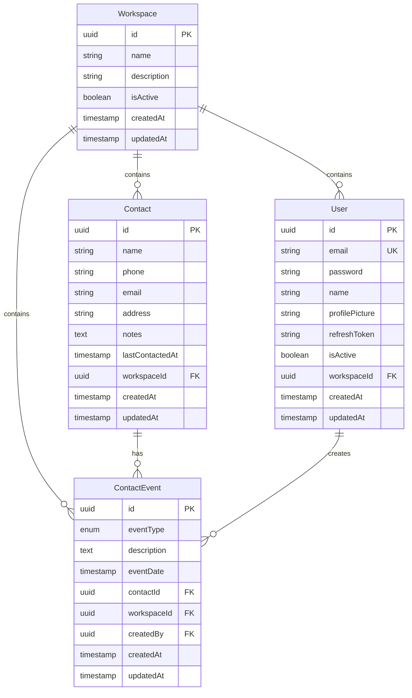

# Contacts Management API Documentation

## Overview

This is a multi-tenant contacts management system built with NestJS, TypeORM, and PostgreSQL. The system supports multiple organizations (workspaces) with isolated data and comprehensive contact management features.

## Architecture

### Multi-Tenant Design

The system implements a multi-tenant architecture where:

- **Workspaces** represent organizations/tenants
- **Users** belong to specific workspaces
- **Contacts** belong to specific workspaces
- **Contact Events** track all activities related to contacts
- Data isolation is enforced at the application layer

### Database Schema



## Authentication

All endpoints (except auth endpoints) require JWT authentication via Bearer token in the Authorization header:

```
Authorization: Bearer <jwt_token>
```

## API Endpoints

### Authentication Endpoints

#### POST /auth/signup

Create a new user account.

```json
{
  "email": "user@example.com",
  "password": "password123",
  "name": "John Doe",
  "workspaceId": "uuid-of-workspace" // optional
}
```

#### POST /auth/login

Login with email and password.

```json
{
  "email": "user@example.com",
  "password": "password123"
}
```

#### POST /auth/refresh

Refresh access token using refresh token.

```json
{
  "refreshToken": "refresh_token_here"
}
```

#### POST /auth/logout

Logout current user.

---

### Workspace Endpoints

#### POST /workspaces

Create a new workspace.

```json
{
  "name": "Acme Corporation",
  "description": "Our main workspace"
}
```

#### GET /workspaces

Get all active workspaces.

#### GET /workspaces/:id

Get workspace details by ID.

#### GET /workspaces/:id/dashboard

Get workspace dashboard with analytics:

```json
{
  "totalContacts": 150,
  "totalEvents": 450,
  "recentContacts": [...],
  "recentEvents": [...]
}
```

#### PATCH /workspaces/:id

Update workspace.

```json
{
  "name": "Updated Name",
  "description": "Updated description",
  "isActive": true
}
```

#### DELETE /workspaces/:id

Soft delete workspace (marks as inactive).

---

### Contact Endpoints

#### POST /contacts

Create a new contact.

```json
{
  "name": "Jane Smith",
  "phone": "+1234567890",
  "email": "jane@example.com",
  "address": "123 Main St, City, State",
  "notes": "Important client",
  "workspaceId": "uuid-of-workspace"
}
```

#### GET /contacts/workspace/:workspaceId

Get all contacts for a workspace.

#### GET /contacts/workspace/:workspaceId/search?q=search_term

Search contacts within a workspace.

#### GET /contacts/:id

Get contact details by ID.

#### PATCH /contacts/:id

Update contact.

```json
{
  "name": "Updated Name",
  "phone": "+0987654321",
  "email": "updated@example.com",
  "address": "456 New St, City, State",
  "notes": "Updated notes",
  "lastContactedAt": "2024-01-15T10:30:00Z"
}
```

#### DELETE /contacts/:id

Delete contact permanently.

---

### Contact Event Endpoints

#### POST /contact-events

Create a new contact event.

```json
{
  "eventType": "call",
  "description": "Called to discuss project requirements",
  "eventDate": "2024-01-15T14:30:00Z",
  "contactId": "uuid-of-contact"
}
```

**Event Types:**

- `call` - Phone call
- `email` - Email communication
- `meeting` - In-person or virtual meeting
- `note` - General note
- `sms` - SMS/text message
- `other` - Other types of interaction

#### GET /contact-events/contact/:contactId

Get all events for a specific contact.

#### GET /contact-events/:id

Get event details by ID.

#### PATCH /contact-events/:id

Update contact event.

```json
{
  "eventType": "meeting",
  "description": "Updated description",
  "eventDate": "2024-01-15T15:00:00Z"
}
```

#### DELETE /contact-events/:id

Delete contact event.

---

### User Endpoints

#### GET /users/:id

Get user details by ID.

#### PATCH /users/:id

Update user profile.

```json
{
  "name": "Updated Name",
  "profilePicture": "https://example.com/avatar.jpg",
  "workspaceId": "new-workspace-uuid"
}
```

## Error Responses

All endpoints return consistent error responses:

```json
{
  "statusCode": 400,
  "message": "Validation failed",
  "error": "Bad Request"
}
```

Common HTTP status codes:

- `400` - Bad Request (validation errors)
- `401` - Unauthorized (authentication required)
- `403` - Forbidden (insufficient permissions)
- `404` - Not Found
- `409` - Conflict (duplicate resource)
- `500` - Internal Server Error

## Data Isolation & Security

### Multi-Tenant Data Isolation

- All data access is filtered by workspace ID
- Users can only access data from their assigned workspace
- API endpoints validate workspace access before performing operations
- Foreign key constraints ensure data integrity

### Authentication & Authorization

- JWT-based authentication with access and refresh tokens
- Password hashing using bcrypt
- User sessions managed through refresh tokens
- Automatic token validation on protected endpoints

### Input Validation

- All inputs validated using class-validator decorators
- Email format validation
- String length constraints
- UUID format validation
- Enum value validation for event types

## Usage Examples

### Complete Workflow Example

1. **Create a workspace:**

```bash
curl -X POST http://localhost:3000/workspaces \
  -H "Authorization: Bearer YOUR_JWT_TOKEN" \
  -H "Content-Type: application/json" \
  -d '{"name": "My Company", "description": "Main workspace"}'
```

2. **Create a contact:**

```bash
curl -X POST http://localhost:3000/contacts \
  -H "Authorization: Bearer YOUR_JWT_TOKEN" \
  -H "Content-Type: application/json" \
  -d '{
    "name": "John Doe",
    "email": "john@example.com",
    "phone": "+1234567890",
    "workspaceId": "workspace-uuid-here"
  }'
```

3. **Log a contact event:**

```bash
curl -X POST http://localhost:3000/contact-events \
  -H "Authorization: Bearer YOUR_JWT_TOKEN" \
  -H "Content-Type: application/json" \
  -d '{
    "eventType": "call",
    "description": "Initial consultation call",
    "eventDate": "2024-01-15T10:00:00Z",
    "contactId": "contact-uuid-here"
  }'
```

4. **Get workspace dashboard:**

```bash
curl -X GET http://localhost:3000/workspaces/workspace-uuid-here/dashboard \
  -H "Authorization: Bearer YOUR_JWT_TOKEN"
```

## Development Setup

### Prerequisites

- Node.js 18+
- PostgreSQL 12+
- npm or pnpm

### Installation

```bash
# Install dependencies
pnpm install

# Setup environment variables
cp .env.example .env

# Run migrations
npm run migration:run

# Start development server
npm run start:dev
```

### Environment Variables

```env
DB_HOST=localhost
DB_PORT=5432
DB_USERNAME=postgres
DB_PASSWORD=postgres
DB_NAME=highlevel_dev
JWT_ACCESS_SECRET=your-jwt-access-secret
JWT_REFRESH_SECRET=your-jwt-refresh-secret
NODE_ENV=development
```

## Database Migrations

Run migrations to set up the database schema:

```bash
# Run all pending migrations
npm run migration:run

# Revert last migration
npm run migration:revert

# Generate new migration
npm run migration:generate -- -n MigrationName
```

## Testing

```bash
# Unit tests
npm run test

# End-to-end tests
npm run test:e2e

# Test coverage
npm run test:cov
```

## Performance Considerations

### Database Optimization

- Proper indexing on foreign keys and search fields
- Connection pooling configured
- Pagination implemented for large datasets
- Query optimization using TypeORM query builder

### API Optimization

- JWT token caching
- Efficient data loading with relations
- Bulk operations where applicable
- Response compression enabled

### Scalability

- Stateless API design
- Horizontal scaling ready
- Database connection pooling
- Caching layer ready for implementation
